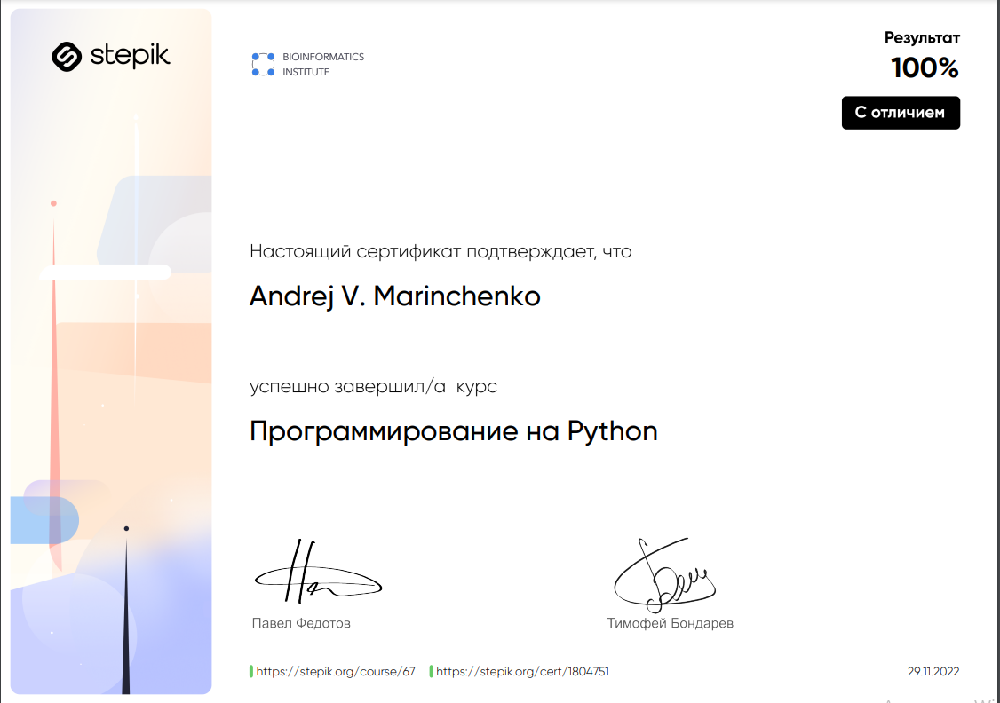

<div align="center">


# Программирование на Python

</div>

## Как это работает?

Все очень просто: переходи по [ссылке](https://stepik.org/course/67/syllabus) курса и учись, а если уже все идие закончились обращайся к моим подсказкам.

## Порядок подготовки и работы с ботом

1. Клонировать репозиторий либо скачать архив из github или при помощи следующих команд в командной строке
   ```commandline
   $ cmd
   $ git clone https://github.com/BEPb/stepik_python
   $ cd stepik_python
   ```

2. Создать виртуальное окружение Python.
3. Установить все необходимые пакеты для работы нашего кода, при помощи следующей команды:

    ```
    pip install -r requirements.txt
    ```

4. Цель этого репозитория, помочь начинающему программисту получить знания, ну и как награду сертификат


